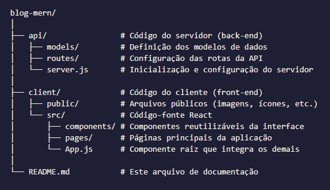

# Blog MERN: Meu Diário de Desenvolvimento

Bem-vindo ao meu projeto de blog desenvolvido com a stack MERN (MongoDB, Express.js, React e Node.js). Este espaço é dedicado a compartilhar experiências, aprendizados e desafios enfrentados durante o desenvolvimento desta aplicação.

## Sobre o Projeto

Este blog nasceu da vontade de criar uma plataforma completa onde usuários pudessem expressar suas ideias, compartilhar conhecimentos e interagir com conteúdo de qualidade. A escolha da stack MERN foi motivada pela sua robustez e pela possibilidade de trabalhar com JavaScript tanto no front-end quanto no back-end.

## Funcionalidades Principais

- **Publicação de Postagens:** Permite que os usuários criem e publiquem novos artigos no blog.
- **Leitura de Conteúdo:** Disponibiliza uma interface limpa e intuitiva para leitura das postagens.
- **Edição de Postagens:** Autores podem atualizar o conteúdo de seus artigos conforme necessário.
- **Remoção de Postagens:** Possibilita a exclusão de artigos que não são mais relevantes ou precisos.

## Tecnologias Utilizadas

- **MongoDB:** Banco de dados NoSQL escolhido pela sua flexibilidade e escalabilidade.
- **Express.js:** Framework que simplifica o desenvolvimento de rotas e middleware no Node.js.
- **React:** Biblioteca que facilita a criação de interfaces de usuário interativas e responsivas.
- **Node.js:** Ambiente de execução que permite utilizar JavaScript no servidor, unificando a linguagem em todo o projeto.

## Estrutura do Projeto

A organização do projeto foi pensada para separar claramente as responsabilidades de cada camada:



## Pré-requisitos

Para executar o projeto localmente, certifique-se de ter instalado em sua máquina:

- [Node.js](https://nodejs.org/): Ambiente de execução para JavaScript no servidor.
- [MongoDB](https://www.mongodb.com/): Banco de dados NoSQL para armazenamento das postagens.

## Como Executar o Projeto

1. **Clone o repositório:**

    ```bash git clone https://github.com/ArielNunesS/blog-mern.git```

2. **Instale as dependências do servidor:**

    ```bash cd blog-mern/api```
    ```bash npm install```
3. **Inicie o servidor:**

    ```bash npm start```

4. **Instale as dependências do cliente:**

    ```bash cd blog-mern/client```
    ```bash npm install```

5. **Inicie o cliente:**
    ```bash npm start```

## Contribuições

Este projeto é um trabalho em andamento e estou aberto a sugestões, críticas construtivas e colaborações. Se você tiver ideias ou encontrar problemas, sinta-se à vontade para abrir issues ou enviar pull requests.